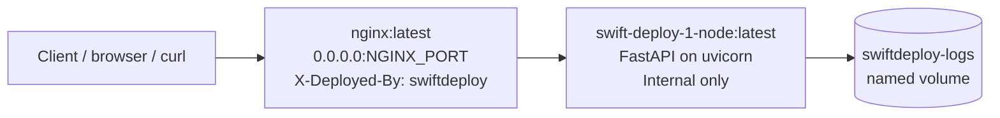
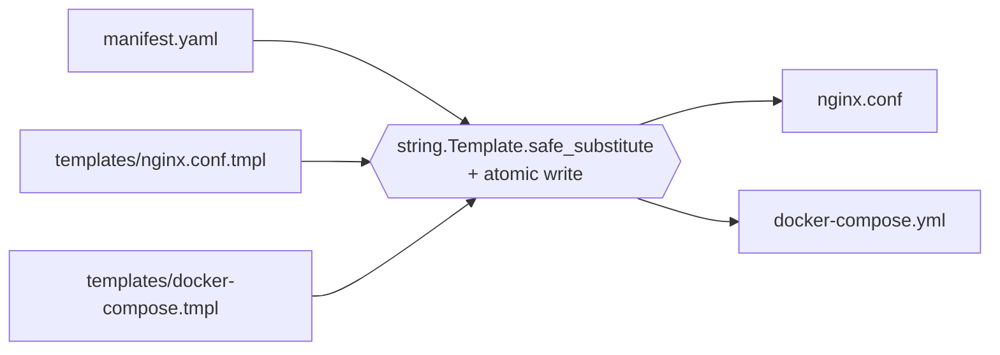
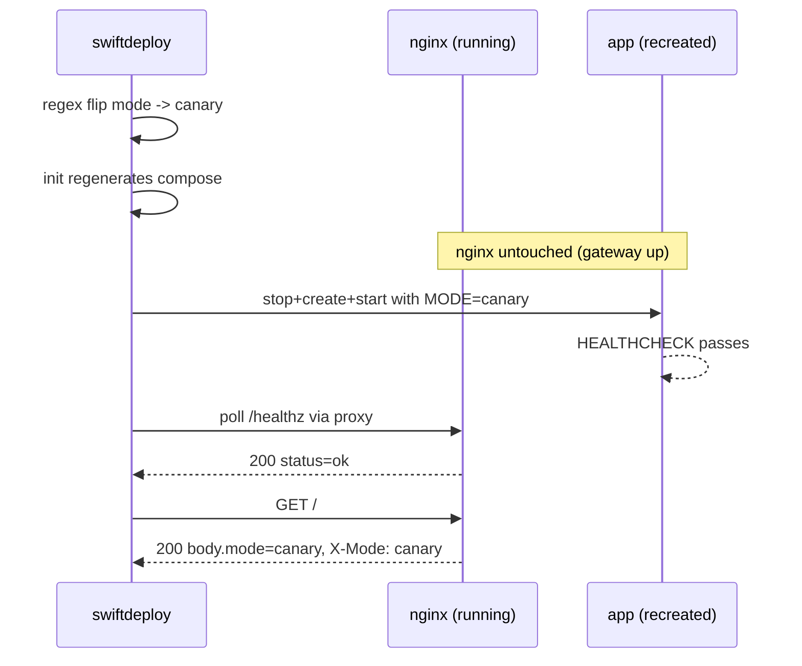
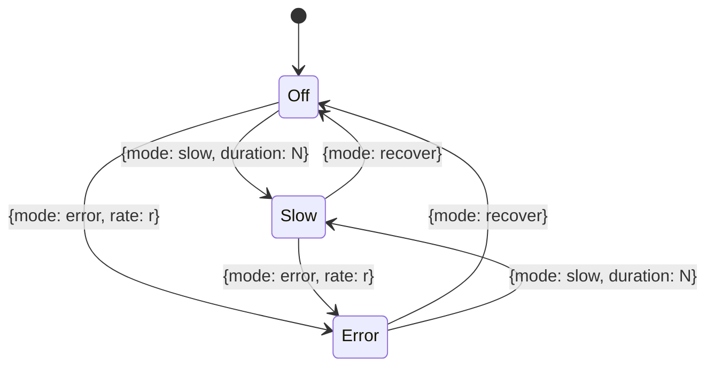

<!-- Draft. Manual publish on dev.to once final QA is green. -->

# SwiftDeploy: Building A Manifest-Driven Deployment Tool

Most DevOps tasks ask you to configure infrastructure manually. This one
asks you to build the tool that does it for you. You write a declarative
`manifest.yaml` describing the deployment, then build a CLI called
`swiftdeploy` that generates every other file from it, manages the container
lifecycle, and keeps the stack running.

The grader's literal test is `rm nginx.conf docker-compose.yml &&
./swiftdeploy init && ls`. If the regenerated files are not byte-identical
to what you started with, your stack is broken.

This article walks through the architecture, the design choices that survive
that test, the bugs I caught while building it, and the proof artifacts that
back every claim.

## What the task is really testing

| Surface | Underlying skill |
|---|---|
| CLI with subcommands and exit codes | Process control, `set -euo pipefail`, return-code propagation |
| Templates rendered into generated configs | Idempotency, separation of intent from artifact |
| Canary/stable promote | Rolling restart semantics, env-driven mode |
| Non-root, dropped capabilities | Container security hardening |
| `/chaos` endpoint | Fault injection, async behavior, observable state |

The brief says canary adds `X-Mode: canary` to **every** response, including
4xx and 5xx. That single word ("every") is the difference between a
per-route header injection (misses error responses) and a middleware
(catches them all). The grader will probably curl a 403 and check.

## Architecture



Nginx is the only public service. The app container has no `ports:`
mapping in the rendered compose; if the grader tries to reach the app port
directly they get a connection refused. All traffic must traverse the proxy
so the `X-Deployed-By` header, JSON 502/503/504 bodies, access log format,
and `X-Mode` forwarding actually apply.

## The manifest is the contract

Everything else is derived. The `init` subcommand parses `manifest.yaml`
once, builds a context dictionary, fills in defaults for the optional
extension fields, and renders both templates atomically:



Why `string.Template` and not Jinja2? Zero conditional rendering needs.
Stdlib gives us exact placeholder substitution; Jinja2 would be one more
dependency to defend.

Why `${VAR}` and not `{{VAR}}`? Because the rendered nginx.conf has to emit
the literal nginx variable `${request_time}` (with braces, to disambiguate
the `s` suffix in the brief's mandated log format). `string.Template`
treats `$$` as a literal `$`, so the template stores `$${request_time}s`
and renders to `${request_time}s`. The same trick covers `$$host`,
`$$remote_addr`, etc.

The atomic write pattern (temp file in the same directory, then
`os.replace`) means a crash mid-render leaves the previous version (if any)
intact. No half-written nginx.conf at the canonical path.

## The five validate checks

```bash
$ ./swiftdeploy validate
[PASS] manifest.yaml exists and is valid YAML
[PASS] all required manifest fields are present and non-empty
[PASS] docker image 'swift-deploy-1-node:latest' is present locally
[PASS] nginx port 18080 is free on the host
[PASS] rendered nginx.conf passes 'nginx -t' inside nginx:latest

validate: all 5 checks passed
```

| Check | What it does | Why this implementation |
|---|---|---|
| 1 | Parses manifest YAML | Every later check reads from it; this is the cheapest first check. |
| 2 | Asserts required base fields are non-empty | Protects against an operator removing a field by mistake. |
| 3 | `docker image inspect` for `services.image` | Cleaner exit code than parsing `docker images` output. |
| 4 | `socket.bind('0.0.0.0', port)` | Same kernel call nginx will make. Stdlib only — works where `ss` and `lsof` do not (Git Bash, minimal Linux containers). |
| 5 | `docker run --entrypoint nginx -t -q` against rendered nginx.conf | Same binary we deploy. `--entrypoint nginx` bypasses the upstream image's entrypoint scripts that would otherwise mutate the config and contaminate the output. |

The script exits non-zero on any failure. On my dev box Apache holds 8080,
so check 4 catches a real conflict and exits 1 — captured as proof in
`blog/assets/proof_outputs/00_validate_with_conflict.txt`. That failure
mode is part of the evidence story: it shows the check actually catches
things instead of always returning PASS.

## Stable vs canary, and the rolling restart

`promote canary` mutates `services.mode` in `manifest.yaml` *in place* with
a targeted regex (not a `yaml.safe_dump` round-trip — that strips comments
and quoting). The post-edit `yaml.safe_load` confirms the result is still
valid YAML. Then `init` regenerates compose with the new MODE env, and
`docker compose up -d --no-deps --force-recreate app` recreates only the
app container. nginx stays up the entire time:



Why `up -d --no-deps --force-recreate` and not `restart`? `restart` reuses
the existing container and its baked env. The new MODE only takes effect
when the container is actually recreated. `--no-deps` prevents nginx from
also being recreated (the gateway stays up). `--force-recreate` covers
canary→canary where compose otherwise sees no diff and skips.

The "rolling restart" of a single-instance upstream isn't literal rolling.
What you can prove is that nginx kept serving requests while the upstream
cycled. The captured access log shows it:

```
2026-05-03T17:51:50+00:00 | 200 | 0.007s | 172.18.0.2:3000 | GET /healthz
2026/05/03 17:52:28 [error] connect() failed (111: Connection refused)
2026-05-03T17:52:28+00:00 | 502 | 0.001s | 172.18.0.2:3000 | GET /healthz
2026-05-03T17:52:30+00:00 | 200 | 0.008s | 172.18.0.2:3000 | GET /healthz
2026-05-03T17:52:31+00:00 | 200 | 0.002s | 172.18.0.2:3000 | GET /
```

The 502 entries during the recreate window are PROOF nginx stayed up — if
nginx had been down too, no log line would exist at all.

The promote command confirms the new mode by curling `/` through nginx and
asserting BOTH that the response body's `mode` matches AND that the
`X-Mode: canary` header is present. Two independent signals: defense in
depth at the contract level.

## Chaos and the recovery escape hatch



Two design points worth defending:

**The `/chaos` endpoint itself is exempt from chaos effects.** With error
rate=1.0, every other endpoint returns 500. If `/chaos` were also affected,
recovery would be impossible. The middleware bypasses chaos when
`request.url.path == "/chaos"`. The smoke test asserts: rate=1.0 plus
`POST /chaos {recover}` still returns 200.

**The X-Mode middleware is registered AFTER the chaos middleware**, which
in FastAPI/Starlette makes it the OUTER wrapper. That means it sees the
final response — including the chaos-injected 500 — and stamps `X-Mode:
canary` on it. The brief says "every response"; this is the only ordering
that actually delivers that.

The captured access log includes a `0.504s` entry on `/healthz` under slow
chaos (`POST /chaos {mode: slow, duration: 0.5}`). nginx logged the upstream
round-trip time; the 0.504s confirms `asyncio.sleep(0.5)` actually slept.

In stable mode every chaos POST returns `403 {"detail": "chaos disabled in
stable mode"}` — not 404. 403 expresses the policy ("chaos is disabled
here"); 404 would be ambiguous with a typo'd path. The route topology is
constant across modes; only behavior changes.

## Hardening summary

```mermaid
flowchart TB
    subgraph Image
        B[python:3.11-slim ~150 MB]
        D[FastAPI + uvicorn[standard] ~86 MB]
        U[appuser uid/gid 10001<br/>no-create-home, nologin]
        H[HEALTHCHECK: python urllib /healthz]
    end
    subgraph Runtime
        UB[user: 10001:10001]
        C1[cap_drop: ALL]
        C2[nginx adds back CHOWN, SETUID, SETGID, NET_BIND_SERVICE]
        S[security_opt: no-new-privileges:true]
        P[app: no ports mapping]
    end
```

Why `python:3.11-slim` and not alpine? The `uvicorn[standard]` extra pulls
in `uvloop`, which ships glibc-only manylinux wheels. Alpine is musl —
forces a from-source compile. Slim is Debian glibc, so the wheels install
in seconds.

Why `--no-cache-dir` in `pip install`? pip's wheel cache only helps across
separate runs on the same host. Each Docker `RUN` is its own layer; the
cache it builds is never read again. Caching just bakes 30+ MB of unused
tarballs into the image.

Why is the in-container HEALTHCHECK `python -c urllib.request.urlopen(...)`
instead of `curl --fail`? `curl` is not in `python:3.11-slim`. Apt-getting
it adds an entire layer for one HTTP probe. Python is already in the image.

Why is `cap_drop: ALL` in the Compose template, not the Dockerfile?
Capabilities are a runtime container property managed by runc, not an image
property. Dockerfiles describe what the image *contains*; Compose describes
how the runtime starts it. Caps belong with the runtime.

Final image size: 236 MB. The cap is 300 MB. 64 MB of headroom.

## Three real bugs I caught during the build

Stage 4's brief said: "anyone who can't explain their work will fail the
task." So here are the real failures, with the fix and the lesson.

### Bug 1: Microsoft Store stub for `python3`

On my Windows dev box, `command -v python3` resolves to a path that *exists*
but is the Microsoft Store launcher stub. Invoking it without args prints a
"go install Python from the Store" message and exits non-zero. My CLI's
interpreter resolver was doing this:

```bash
PY="$(command -v python3 || command -v python || true)"
```

…and getting back the broken stub. The fix:

```bash
PY=""
for cand in python3 python; do
    cand_path="$(command -v "$cand" 2>/dev/null || true)"
    if [[ -n "${cand_path}" ]] && "${cand_path}" --version >/dev/null 2>&1; then
        PY="${cand_path}"
        break
    fi
done
```

Lesson: a PATH lookup is necessary but not sufficient. Probe before you
trust.

### Bug 2: Heredoc path mismatch on Git Bash

Validate check 1 was failing with "manifest.yaml exists but is not valid
YAML" — even though check 2 (which parsed the same file) passed. Repro:

```bash
$ "${PY}" - <<PYEOF
import yaml
yaml.safe_load(open(r"${MANIFEST}", "r", encoding="utf-8"))
PYEOF
FileNotFoundError: '/c/Users/Hp/Documents/hng14/devops-stage4/manifest.yaml'
```

Bash expanded `${MANIFEST}` (correct), but Windows-native Python doesn't
understand the Git Bash mingw path `/c/Users/...`. The fix was to pass the
path as `argv` (where MSYS auto-translates to `C:\Users\...`) and quote the
heredoc delimiter so bash doesn't expand inside the body:

```bash
"${PY}" - "${MANIFEST}" <<'PYEOF'
import sys, yaml
yaml.safe_load(open(sys.argv[1], "r", encoding="utf-8"))
PYEOF
```

Lesson: in cross-platform CLIs, prefer argv to in-body string interpolation.
The shell's path translation usually only kicks in for argv.

### Bug 3: `yaml.safe_dump` strips comments

The first `manifest_set_mode` implementation used `yaml.safe_load` ->
mutate dict -> `yaml.safe_dump`. Functionally correct: the manifest still
parsed and `init` rendered identical compose files. But:

```diff
-# Single source of truth for the SwiftDeploy stack.
-# `swiftdeploy init` regenerates nginx.conf and docker-compose.yml from this file.
-# Do not hand-edit the generated files; edit this file and rerun `init`.
-
 services:
   image: swift-deploy-1-node:latest
   port: 3000
-  mode: stable
-  version: "1.0.0"
+  mode: canary
+  version: 1.0.0
```

`safe_dump` round-tripped the entire file, losing the comment header, the
blank lines, and the original string quoting on `version`. Switching to a
targeted regex:

```python
new_text, n = re.subn(
    r"(?m)^(\s*mode:[ \t]+)\S+",
    lambda m: m.group(1) + target,
    text,
    count=1,
)
```

…changes exactly one line. `git diff manifest.yaml` after promote now
shows a single-line diff. A post-edit `yaml.safe_load` sanity check
catches the case where the regex produces invalid YAML.

Lesson: when the brief says "in place," the right interpretation is
"smallest possible change," not "rewrite from a parsed object."

## Six interview questions worth rehearsing

Pulled from `docs/stage4-control-plane/08_interview_defense_bank.md`:

1. **Why is the X-Mode middleware registered after the chaos middleware?**
   Last-registered = outermost in FastAPI/Starlette. The X-Mode middleware
   sees the final response, including the chaos-injected 500. The brief
   says "every response"; this is the only ordering that delivers that.

2. **Why is `/chaos` exempt from chaos effects?**
   Recovery escape hatch. With error rate=1.0, every other endpoint
   returns 500; if `/chaos` were also affected, the operator could never
   recover.

3. **Why use `socket.bind()` instead of `ss -tln` for the port pre-flight?**
   `bind()` is the same kernel call nginx will make. Stdlib only,
   cross-platform. `ss` is not present on Git Bash for Windows or on
   minimal Linux containers without iproute2.

4. **Why is `cap_drop: ALL` in Compose and not the Dockerfile?**
   Linux capabilities are a runtime container property managed by runc,
   not an image property. Dockerfiles describe images; Compose describes
   how the runtime starts them.

5. **Why `up -d --no-deps --force-recreate app` and not `compose restart app`?**
   `restart` reuses the container with its baked env. We need the new MODE
   from the regenerated compose file. `up -d` recreates on config change;
   `--no-deps` keeps nginx alive; `--force-recreate` covers the
   canary→canary case where compose otherwise sees no diff.

6. **How do you prove `init` is idempotent?**
   Three measurements. Hash the generated files; re-run `init`; confirm
   identical hashes. `rm` the files; run `init`; confirm same hashes.
   Captured in evidence E-006: nginx.conf SHA = 809a2ff0...07fa0d on every
   run.

## Reproducible proof bundle

```bash
docker build -t swift-deploy-1-node:latest .
bash scripts/capture_evidence.sh
```

That writes 8 plain-text files into `blog/assets/proof_outputs/`. They
cover the brief's five required screenshots plus the failure-mode capture
(check 4 detecting Apache on 8080) and the idempotency proof. The script
is the canonical way to reproduce the evidence; running it on a clean
machine gives the same artifacts.

## What I would do if I had another week

- Add a `swiftdeploy logs` subcommand for tailing the nginx access log
  with optional grep (right now I use `docker compose logs nginx` directly).
- Switch `manifest_set_mode` to ruamel.yaml for round-trip-preserving
  edits, removing the regex constraint about future schema additions.
- Add a `--port=` override on `validate` and `deploy` so I don't have to
  edit the manifest temporarily on dev boxes with port conflicts.
- Add a Compose profile for a load generator alongside the chaos endpoint,
  so the access log also captures throughput-under-chaos behavior.

## Closing

The single most important sentence in the brief is: "the manifest is the
single source of truth." Every design choice in this build is downstream
of that. Templates are intent. Generated files are derived artifacts.
Promote mutates one line. Teardown --clean restores the manifest-only
state. The grader's regeneration test is the easy part once the rest of
the contract is honored.
