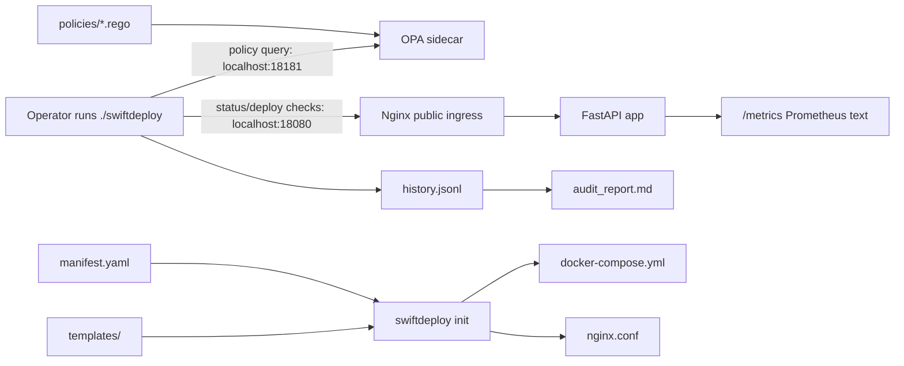

# SwiftDeploy Stage 4B: Observability, Policy, and Audit

Stage 4A built the deployment engine: a manifest, templates, Docker Compose,
Nginx, and a CLI that could deploy, promote, and tear down the stack. Stage 4B
adds the control loop around that engine.

The new version has three extra responsibilities:

- **Eyes**: `/metrics` exposes Prometheus text for requests, latency, mode, uptime,
  and chaos state.
- **Brain**: OPA owns every allow/deny decision for deploy and promote.
- **Memory**: `history.jsonl` records status/policy checks; `audit_report.md`
  renders the audit trail.

---

## Architecture

The full system looks like this:



Key isolation guarantees:

- OPA is bound to `127.0.0.1:18181` — the CLI reaches it but the public Nginx
  ingress has no upstream for it.
- The app container has no `ports:` mapping — only Nginx publishes externally.
- Rego policy files mount into OPA read-only (`./policies:/policies:ro`).

---

## Design

`manifest.yaml` is still the only file you edit manually. It now includes four
new top-level sections that `swiftdeploy init` consumes to render both generated
files:

```yaml
opa:
  image: openpolicyagent/opa:1.16.1
  port: 18181

policy:
  infrastructure:
    min_disk_free_gb: 10
    max_cpu_load: 2.0
  canary:
    max_error_rate: 0.01
    max_p99_latency_seconds: 0.5
    window_seconds: 30

observability:
  history_file: history.jsonl
  audit_report: audit_report.md
  status_interval: 5
```

The `opa:` block feeds into `templates/docker-compose.tmpl` via
`string.Template.safe_substitute`. The relevant template stanza:

```yaml
  opa:
    image: ${OPA_IMAGE}
    container_name: swiftdeploy-opa
    command:
      - run
      - --server
      - --addr=0.0.0.0:8181
      - --log-level=info
      - /policies
    ports:
      - "127.0.0.1:${OPA_PORT}:8181"
    networks:
      - ${NETWORK_NAME}
    restart: ${RESTART_POLICY}
    cap_drop:
      - ALL
    security_opt:
      - no-new-privileges:true
    read_only: true
    volumes:
      - ./policies:/policies:ro
```

`swiftdeploy init` calls `config.render_templates()`:

```python
def render_templates() -> None:
    ensure_policy_source()
    ctx = manifest_context()          # pulls all ${VARS} from manifest.yaml
    for tmpl_path, out_path in ((NGINX_TMPL, NGINX_OUT), (COMPOSE_TMPL, COMPOSE_OUT)):
        rendered = Template(tmpl_path.read_text(encoding="utf-8")).safe_substitute(ctx)
        atomic_write(out_path, rendered)
```

`string.Template.safe_substitute` leaves unknown `${...}` tokens alone, so Nginx
variables like `${request_time}` in the nginx template survive rendering intact.
The `atomic_write` helper uses `tempfile.mkstemp` + `os.replace` to avoid
corrupted configs if the process is interrupted.

The `policy:` thresholds are exposed as `config.policy_config(manifest)` and
sent to OPA as part of the input document — they are never hardcoded in Rego.

---

## Guardrails

**The core principle:** the CLI gathers facts; OPA decides; the CLI enforces
and explains. No threshold logic lives in Python.

### Infrastructure policy (pre-deploy)

The `policies/infrastructure.rego` disk-free deny rule:

```rego
deny contains {
    "id": "disk_free_too_low",
    "message": sprintf("disk free %vGB is below required %vGB",
                       [input.host.disk_free_gb, input.thresholds.min_disk_free_gb]),
    "observed": input.host.disk_free_gb,
    "threshold": input.thresholds.min_disk_free_gb,
} if {
    supported_question
    input.host.disk_free_gb < input.thresholds.min_disk_free_gb
}
```

`input.thresholds` is populated by `swiftdeploy_lib/policy.py`:

```python
def infrastructure_input(question: str) -> dict[str, Any]:
    manifest = config.load_manifest()
    return {
        "question": question,
        "host": host_stats(),                                       # disk_free_gb, cpu_load
        "thresholds": config.policy_config(manifest)["infrastructure"],  # from manifest.yaml
    }
```

The threshold values come from `manifest.yaml` → `config.policy_config()` →
`input.thresholds`. Changing a limit means editing one field in `manifest.yaml`
and rerunning `swiftdeploy init`; the Rego file never needs to change.

### Canary safety policy (pre-promote)

The `policies/canary.rego` error-rate deny rule follows the same pattern — the
CLI scrapes `/metrics`, calculates `error_rate` and `p99_latency_seconds`, wraps
them in a `canary_input()` document, and sends it to OPA. The decision object
always contains `allowed`, `reason`, and a `violations` list so the CLI can
surface the exact violation to the operator.

OPA returns no bare booleans. Every denial carries its reason.

### Distinct failure modes

If OPA is unavailable the CLI never silently continues. The five named failure
modes are: `opa_timeout`, `opa_unavailable`, `opa_policy_error`,
`opa_malformed_response`, `opa_unhealthy`. Each produces a distinct,
human-readable message.

---

## Chaos

In canary mode, `POST /chaos` can inject slow responses or errors. The metrics
endpoint remains reachable during chaos so the policy loop can observe the
failure instead of going blind.

### What happened when error chaos blocked promotion

```
$ curl -X POST /chaos error rate=1.0
HTTP/1.1 200 OK
Server: nginx/1.29.8
Date: Wed, 06 May 2026 17:01:15 GMT
Content-Type: application/json
Content-Length: 52
Connection: keep-alive
x-mode: canary
X-Deployed-By: swiftdeploy

{"chaos":{"mode":"error","duration":0.0,"rate":1.0}}
$ ./swiftdeploy promote stable    # expect canary safety denial
 Container swiftdeploy-opa Running 
[FAIL] promote blocked by policy; manifest.yaml was not changed
swiftdeploy promote: target mode=stable
swiftdeploy init: rendering generated files from C:\Users\Hp\Documents\hng14\devops-stage4\manifest.yaml
rendered nginx.conf <- templates\nginx.conf.tmpl
rendered docker-compose.yml <- templates\docker-compose.tmpl
OK: nginx.conf and docker-compose.yml regenerated.
swiftdeploy policy: starting OPA sidecar
[PASS] OPA health check passed
  policy: querying canary safety before manifest mutation
[FAIL] policy/canary: canary safety policy denied: 1 violation(s)
  - error_rate_too_high: error rate 1.0000 is above allowed 0.0100
expected promote denial exit=1

$ curl -X POST /chaos recover
HTTP/1.1 200 OK
Server: nginx/1.29.8
Date: Wed, 06 May 2026 17:01:22 GMT
Content-Type: application/json
Content-Length: 49
Connection: keep-alive
x-mode: canary
X-Deployed-By: swiftdeploy

{"chaos":{"mode":null,"duration":0.0,"rate":0.0}}
```

Reading the sequence: error chaos is injected → the canary is now generating
100% errors → the promote command queries OPA → OPA reports
`error_rate_too_high: error rate 1.0000 is above allowed 0.0100` →
`[FAIL] promote blocked by policy; manifest.yaml was not changed`. The last line
is the critical safety guarantee: OPA runs its check *before* the manifest is
mutated. A failed policy check leaves the stack in the previous state.

---

## Replication

Follow these steps to run the full Stage 4B lifecycle on your own machine:

1. **Clone the repo**
   ```bash
   git clone <repo-url> swiftdeploy && cd swiftdeploy
   ```

2. **Install prerequisites** — Docker Desktop, Python 3.11+, PyYAML, Git Bash
   (on Windows). On Linux/macOS, the system shell is fine.
   ```bash
   pip install pyyaml
   ```

3. **Build and deploy**
   ```bash
   docker build -t swiftdeploy-stage4b-app:1.0.0 .
   ./swiftdeploy deploy
   ```
   The deploy command runs `swiftdeploy init` (renders configs), starts the OPA
   sidecar, queries the infrastructure policy (disk free + CPU load), and only
   brings up the app and Nginx containers if OPA approves.

4. **Check the live status dashboard**
   ```bash
   ./swiftdeploy status --once    # single snapshot
   ./swiftdeploy status           # live refresh every 5 s
   ```

5. **Promote to canary mode**
   ```bash
   ./swiftdeploy promote canary
   ```

6. **Inject chaos** (triggers an error response rate of 100 %)
   ```bash
   curl -s -X POST -H "Content-Type: application/json" \
     -d '{"mode":"error","rate":1.0}' http://127.0.0.1:18080/chaos
   ```

7. **Try to promote to stable — expect denial**
   ```bash
   ./swiftdeploy promote stable
   # [FAIL] policy/canary: canary safety policy denied: 1 violation(s)
   ```

8. **Recover and promote successfully**
   ```bash
   curl -s -X POST -H "Content-Type: application/json" \
     -d '{"mode":"recover"}' http://127.0.0.1:18080/chaos
   ./swiftdeploy promote stable
   ```

9. **View the audit trail**
   ```bash
   ./swiftdeploy audit && cat audit_report.md
   ```

10. **Tear down**
    ```bash
    ./swiftdeploy teardown --clean
    # Regenerate to verify idempotency:
    ./swiftdeploy init
    ```

---

## Lessons Learned

### (a) CLI as enforcer, OPA as decision-maker

The most important architectural line is the boundary between the CLI and OPA.
If the CLI reads threshold values and compares them itself, OPA becomes
decoration that can be bypassed. The defensible design keeps the CLI in the
"gather facts, call OPA, enforce result" role and puts all comparison logic
exclusively in Rego. This means a new policy rule never requires touching Python
— only the `.rego` file changes, and the manifest already owns the thresholds.

### (b) The 30-second pre-promote window design choice

The brief asks for error rate and P99 latency "over the last 30 seconds." The
implementation uses a live two-snapshot window: the CLI takes one metrics scrape,
makes several `/healthz` pings to generate traffic, then takes a second scrape
roughly 1–1.3 seconds later. The delta across that window is what OPA evaluates.

The design trade-off is low latency vs. confidence window. A rolling 30-second
window drawn from `history.jsonl` would be more statistically robust, but it
requires the operator to have been running `swiftdeploy status` continuously for
at least 30 seconds before promoting. The live two-scrape approach gives an
immediate signal: if the canary is producing errors *right now*, the promotion
is blocked within about 1 second of starting the promote command. The
`policy_window_target_seconds=30` field is recorded in history for auditing but
is not enforced as a gate. Operators who want a longer confidence window should
run `swiftdeploy status` for ≥30 seconds before promoting; the rolling history
in `history.jsonl` will then contain a 30-second picture they can audit.

> **NOTE (promote gate design):** The pre-promote gate uses a live two-snapshot
> delta window (~1 second). The `status --interval N` loop builds continuous
> history in `history.jsonl`; operators who want a longer pre-promote confidence
> window should run `status` for ≥30 seconds before promoting.

### (c) Windows portability: getloadavg is unavailable

`os.getloadavg()` is a POSIX function that does not exist on Windows. The
`host_stats()` function in `swiftdeploy_lib/policy.py` catches `AttributeError`
and falls back to `cpu_load = 0.0`. On the development machine (Windows 11),
every `pre_deploy` record in `history.jsonl` shows `"cpu_load": 0.0`. The CPU
policy check never fires from real load on Windows. To demonstrate the CPU
policy path on Windows, the proof bundle (`12_cpu_policy_denial.txt`) sets
`max_cpu_load: -1.0` so that `0.0 > -1.0` triggers the denial rule. On Linux
or macOS, `getloadavg()` returns real values and a threshold of `2.0` is
sufficient.

### (d) Generated artifact discipline

The source of truth is `manifest.yaml`. `nginx.conf` and `docker-compose.yml`
are outputs, not inputs — they must never be hand-edited. The proof of this
discipline is the teardown-and-regen test: `swiftdeploy teardown --clean`
deletes both generated files, then `swiftdeploy init` regenerates
byte-identical copies. Any drift between the manifest and the generated files
is caught immediately because `init` always runs before `deploy` and
`promote`. Keeping generated artifacts out of the manual-edit loop also means
the submission grader can verify idempotency with a single command.
