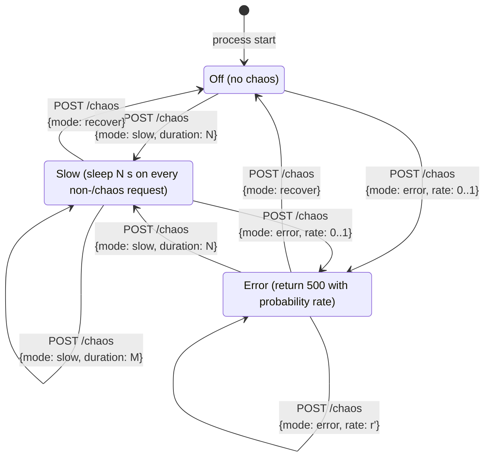

# Chaos state machine (canary mode only)

In stable mode every transition above is replaced by a single response: 403
with `{"detail": "chaos disabled in stable mode"}`. The state machine never
moves.

The `/chaos` endpoint itself is exempt from chaos effects so that an
operator can always recover from rate=1.0 or duration=10000.
