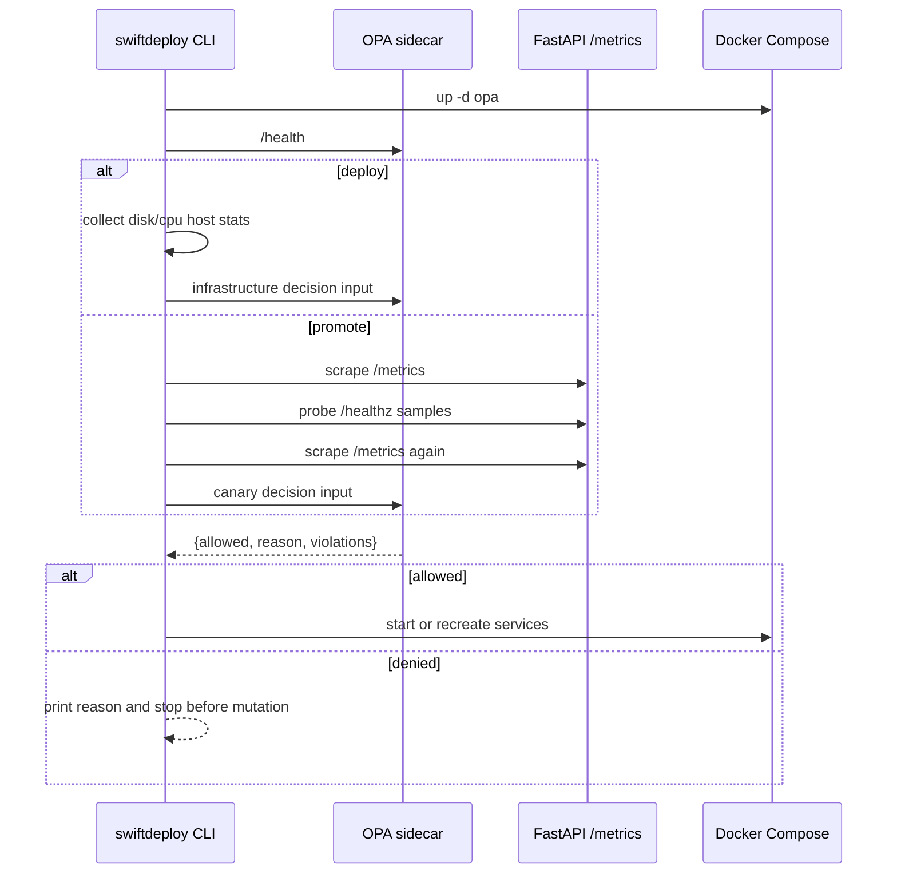

# Policy Gate Flow

```mermaid
sequenceDiagram
    participant CLI as swiftdeploy CLI
    participant OPA as OPA sidecar
    participant App as FastAPI /metrics
    participant Docker as Docker Compose

    CLI->>Docker: up -d opa
    CLI->>OPA: /health
    alt deploy
        CLI->>CLI: collect disk/cpu host stats
        CLI->>OPA: infrastructure decision input
    else promote
        CLI->>App: scrape /metrics
        CLI->>App: probe /healthz samples
        CLI->>App: scrape /metrics again
        CLI->>OPA: canary decision input
    end
    OPA-->>CLI: {allowed, reason, violations}
    alt allowed
        CLI->>Docker: start or recreate services
    else denied
        CLI-->>CLI: print reason and stop before mutation
    end
```

