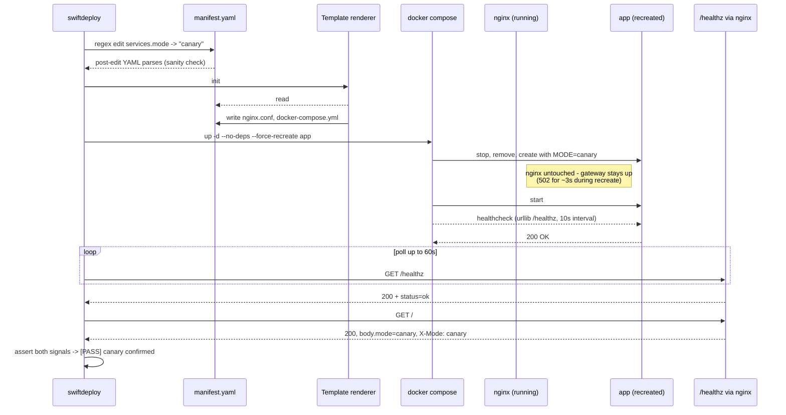

# `swiftdeploy promote canary` sequence

The two-signal assertion (body.mode AND X-Mode header) is defense in depth:
either signal alone could be wrong if the X-Mode middleware or the / handler
were broken; together they prove the deployment is genuinely canary.
