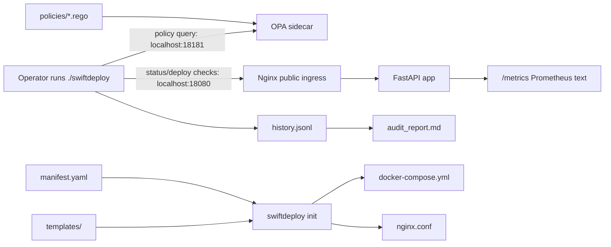

# Stage 4B Architecture

```mermaid
flowchart LR
    operator["Operator runs ./swiftdeploy"] -->|"policy query: localhost:18181"| opa["OPA sidecar"]
    operator -->|"status/deploy checks: localhost:18080"| nginx["Nginx public ingress"]
    nginx --> app["FastAPI app"]
    app --> metrics["/metrics Prometheus text"]
    operator --> history["history.jsonl"]
    history --> audit["audit_report.md"]
    manifest["manifest.yaml"] --> init["swiftdeploy init"]
    templates["templates/"] --> init
    policies["policies/*.rego"] --> opa
    init --> compose["docker-compose.yml"]
    init --> nginxconf["nginx.conf"]
```

